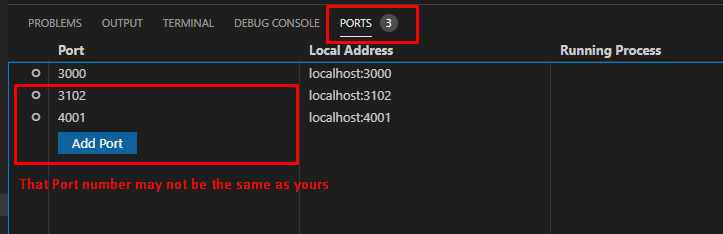

## Welcome to CSCI_3100 Project
### You may view all the Diagram and doc in 
+ [Final Report](https://drive.google.com/file/d/1zQQm_ixMZJcNaAR36l2ncpUCMNDIG9VS/view?usp=sharing)
+ [Initial Design Flow Project](https://drive.google.com/file/d/1bdqj0q4eLsF45A4qghM2rGrc6yCOqg4N/view?usp=sharing)
+ [Backend Information](/backend)
+ [Google drive](https://drive.google.com/drive/folders/1KoTn5ugbMzSGxRS61RfaG0zq1o0gV_ry?usp=sharing) 
+ [OneDrive](https://mycuhk-my.sharepoint.com/personal/1155109240_link_cuhk_edu_hk/_layouts/15/onedrive.aspx?id=%2Fpersonal%2F1155109240%5Flink%5Fcuhk%5Fedu%5Fhk%2FDocuments%2Fcsci3100%5FGroupE6&originalPath=aHR0cHM6Ly9teWN1aGstbXkuc2hhcmVwb2ludC5jb20vOmY6L2cvcGVyc29uYWwvMTE1NTEwOTI0MF9saW5rX2N1aGtfZWR1X2hrL0Vva3dBSDUzZTE5THFzN1ZNLVFtMzBvQkZJSXVVOFF2Ymo3eS1MaUV5M3pFMlE_cnRpbWU9TmhsU1RrYlQyRWc)


### How to run me
use the following code to download the file
```
git clone git@github.com:school-wcwt/csci_3100.git
```

### Requirement
- node version `v15.12.0` or above
- npm version `7.6.3` or above
- MongoDB SetUp => [Click Me](/backend)

### Run Frontend
- cd to `my-app`
- change the `.env.my-app` file to `.env`. This file define the port of that Frontend Can send request to backend
- run `npm init` and `npm install` and `npm start`

### Run backend (Mongo in local)
- cd to `backend`
- change the `.env.backend` to `.env`. This File define the ACCESS & Refresh password and port of MongoDB that are communicating with frontend
- Run `node server.js`

### Run socket-io-server (syn action for mult-user)
- cd to `socket-io-server` 
- Run `node app.js`

## Final Step: 
- Add Mongo and socket's port in your port if your are using Vscode
- 

### Message For Tutor (Will be deleted After June/2021)
- If you have some difficulties for creating DataBase or Email Validation. It may not related to coding issue but the environment setup. 
- We recommend you to email us for quick response or create a new issues for this project 

### Stat/Doc Generate
- Jsdoc (Since we code everything using JSX inside `pages/`, we Jsdoc into that dir)
  1. cd to `my-app`
  2. Run `jsdoc pages -r -d=<TypeYourOutputDirName>`
  3. Example: `jsdoc src -r -d=jsdoc`
- Plato 
  1. cd to `my-app`
  2. Run `plato -r -d <outdirName> <targetDirName>`
  3. Example: `plato -r -d stat_code src/`
### Commands you may use with ***git***
- You may update file using `git pull` 
- (you may want to do this every times as your groupmate might have updated something)
- After all testing , you can use  `git status` to check all the modificed files
- You can either use `git add yourfile` to add them or `git add --all` to add all file in the waiting stage
- After adding your modified file, use `git commit -m "your message" ` to conclude what you have updated
- Finally use `git push` to upload file into github
- If you make and error and want to recover the whole project, you can run `git reset --hard`

### How to trace back version
- use `git log --oneline` to see which version you would like to re-trace and copy the id
- use `git checkout yourid` to review the previous version

### What if you just want to test but do not want to ruin the git folder ?
- Actually you can have a set of copied file and do any testing and commit without affacting the main site
- Step 1: Create a new branch  by `git checkout -b NewBranchName`
- Step 2: Check if you are in the new branch by `git branch`
- Step 3: The star should appear next to new branch and you can do anything in this branch without affacting the main site
- After testing, You can switched back to the main branch by `git checkout main` 

### MongoDB commands ###
-  Getting into mongo:
```
mongo 
use csci3100;
```
- Manipulating collections:
  - `db.getCollectionNames()` returns all collections
  - `db.<collection>.find() ` returns all data in collection
  - `db.<collection>.findOne({param})` returns first data fitting param in collection
- For more: https://docs.mongodb.com/manual/reference/method/ 

